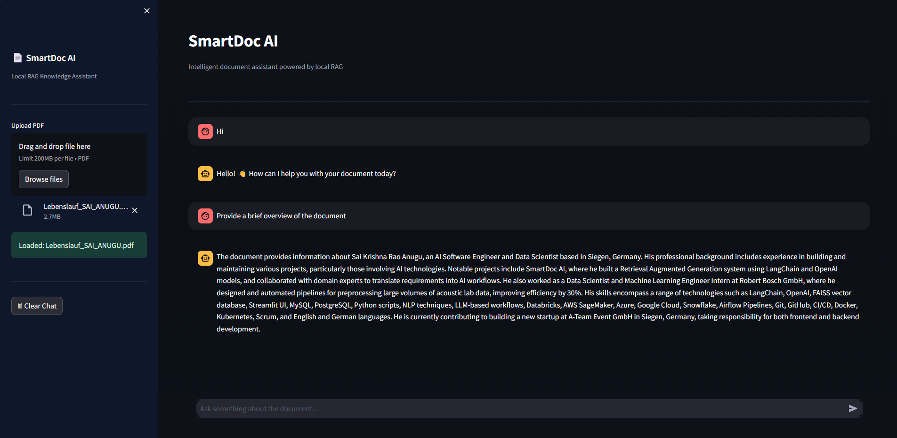

  

# SmartDoc AI

SmartDoc AI is a local Retrieval-Augmented Generation (RAG) based document intelligence assistant built using Streamlit, LangChain, FAISS, and Mistral via Ollama.

It enables users to upload PDF documents and ask intelligent questions powered by semantic search and large language model.

---

## 💡 Why This Project?

SmartDoc AI demonstrates:

- Practical implementation of Retrieval-Augmented Generation (RAG)
- Local LLM deployment using Ollama (no external API dependency)
- Vector similarity search with FAISS
- Intelligent intent routing architecture
- Clean and production-style UI design
- Reproducible dependency management
- Privacy-focused document intelligence for sensitive or confidential files

This project is especially useful when working with important or confidential documents that cannot be uploaded to external AI services such as ChatGPT or other cloud-based LLMs. All processing happens locally, ensuring full data control and enhanced security.

## 🚀 Features

- Local LLM integration using Mistral (via Ollama)
- Semantic search using FAISS vector database
- Retrieval-Augmented Generation (RAG)
- Intelligent intent routing (Greeting / General / Document)
- GPU-accelerated inference (if available)
- Session-based lifecycle cleanup
- Modern UI
- Privacy-focused (fully local processing)

---

## 🧠 System Architecture

User Input  
↓  
Intent Classification (LLM-based routing)  
↓  
Greeting / General / Document Branch  
↓  
FAISS Similarity Search (for document queries)  
↓  
Context Injection  
↓  
Mistral Response Generation  

---

## 🛠 Tech Stack

- Python  
- Streamlit  
- LangChain  
- LangChain-Ollama  
- FAISS (Vector Database)  
- Sentence Transformers  
- PyPDF  
- Ollama (Local LLM Runtime)  
- Mistral-7B Model  

---

## 📦 Installation Guide

### 1️⃣ Clone the Repository

git clone https://github.com/SaiKrishnaRaoAnugu/SmartDoc-AI.git  
cd SmartDoc-AI  

---

### 2️⃣ Create Virtual Environment

python -m venv venv  

Activate:

Windows:  
venv\Scripts\activate  

Mac/Linux:  
source venv/bin/activate  

---

### 3️⃣ Install Dependencies

pip install -r requirements.txt  

---

### 4️⃣ Install Ollama

Download from:  
https://ollama.com  

Then pull Mistral model:

ollama pull mistral  

---

### 5️⃣ Run Application

streamlit run app.py  

App will run at:

http://localhost:8501  

---

## 🔒 Data Privacy & Lifecycle

- All processing happens locally.
- No document data is sent to external servers.
- Uploaded files and FAISS vector databases are automatically cleaned when the app stops.
- Designed for privacy-focused document interaction.

---

## 📌 Key Engineering Highlights

- Modular architecture (separate loader, embeddings, UI)
- Intelligent routing to reduce unnecessary model calls
- Persistent vector storage during session runtime
- Automatic cleanup on application shutdown
- GPU-aware response configuration
- Production-style repository structure

---

## 🚀 Future Improvements

- Token streaming (real-time typing effect)
- Multi-document indexing
- Document citation highlighting
- Dockerized deployment
- Cloud deployment option
- Authentication & multi-user support

---

## 👨‍💻 Author

SaiKrishna Rao Anugu  
AI Software Engineer | RAG Systems | LLM Applications | Generative AI  

---

## ⭐ If You Found This Interesting

Feel free to fork the repository and build on top of it.
